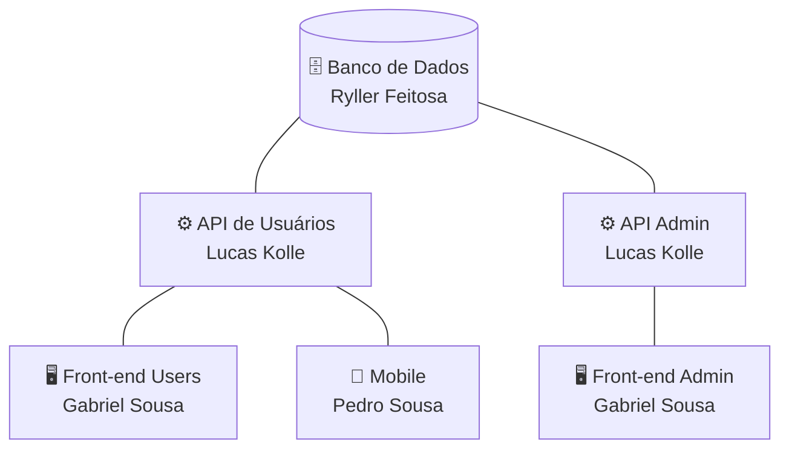
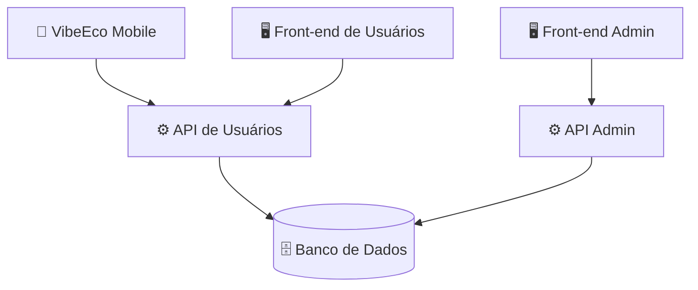
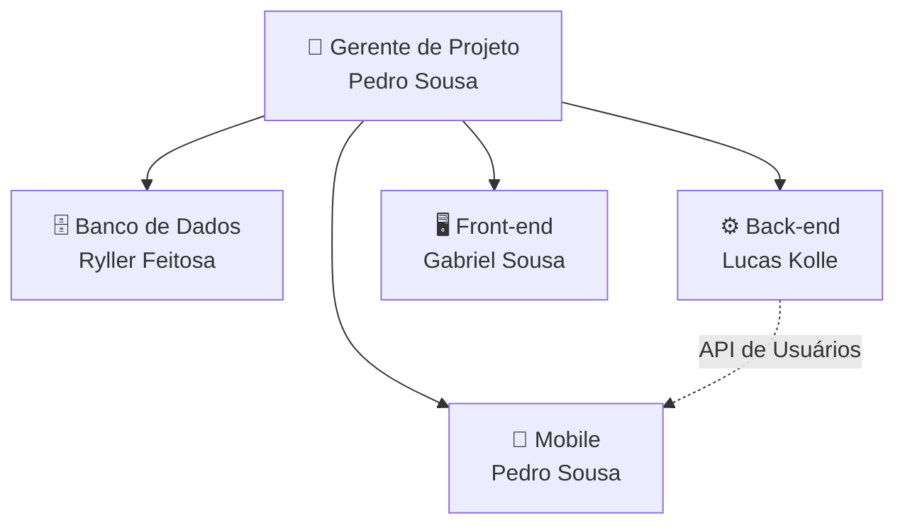

# 🌱 VibeEco

<p align="center">
  <strong>Plataforma Digital de Conscientização e Engajamento em Sustentabilidade</strong>
</p>

<p align="center">
  
</p>

---

## 📌 Sobre o Projeto

O **VibeEco** é uma plataforma digital desenvolvida pela **TechProton** com o objetivo de promover a conscientização e o engajamento em sustentabilidade.

A plataforma utiliza recursos de **conteúdos educativos, missões, desafios, gamificação e interação social** para incentivar os usuários a aprender sobre sustentabilidade e participar de ações sustentáveis.

O projeto foi desenvolvido para ser flexível, podendo ser utilizado em diferentes contextos, como:

- 🏫 Escolas
- 🎓 Universidades
- 🏢 Empresas
- 🌎 ONGs
- 👥 Comunidades
- 🌱 Projetos ambientais
- 🏛️ Outras instituições

---

## 🎯 Objetivo

O principal objetivo do VibeEco é transformar o aprendizado sobre sustentabilidade em uma experiência interativa, contínua e participativa.

A plataforma busca incentivar os usuários a:

- Aprender sobre sustentabilidade;
- Participar de ações sustentáveis;
- Completar missões e desafios;
- Evoluir dentro da plataforma;
- Interagir com outros usuários;
- Compartilhar suas conquistas;
- Receber reconhecimento por sua participação.

### 🔄 Ciclo de experiência

```text
Aprender
   ↓
Participar
   ↓
Completar desafios
   ↓
Ganhar XP
   ↓
Evoluir
   ↓
Interagir
   ↓
Compartilhar
   ↓
Contribuir
```

---

## 🏢 Empresa

### TechProton

A TechProton é uma empresa de tecnologia que desenvolve soluções digitais voltadas à inovação, educação e sustentabilidade.

Seu principal projeto, o VibeEco, consiste em uma plataforma digital de conscientização e engajamento em sustentabilidade, utilizando recursos como conteúdos educativos, missões, desafios, gamificação e interação social para incentivar a participação dos usuários em ações sustentáveis.

---

## 🏗️ Arquitetura do Projeto

O VibeEco é dividido em diferentes componentes, cada um mantido em seu próprio repositório.



### Responsáveis por área

| Área | Responsável |
|------|-------------|
| 🗄️ Banco de Dados | Ryller Feitosa |
| ⚙️ Back-end | Lucas Kolle |
| 🖥️ Front-end | Gabriel Sousa |
| 📱 Mobile | Pedro Sousa |
| 🧑‍💼 Gerenciamento do Projeto | Pedro Sousa |

---

## 📦 Repositórios

O projeto é dividido em seis repositórios principais.

| Área | Repositório | Responsável |
|------|-------------|-------------|
| 🗄️ Banco de Dados | [VibeEco-DataBase](https://github.com/pedsousa06-ai/VibeEco-DataBase) | Ryller Feitosa |
| ⚙️ Back-end Usuários | [VibeEco-Back-End-Users](https://github.com/pedsousa06-ai/VibeEco-Back-End-Users) | Lucas Kolle |
| ⚙️ Back-end Administrativo | [VibeEco-Back-End-Adm](https://github.com/pedsousa06-ai/VibeEco-Back-End-Adm) | Lucas Kolle |
| 🖥️ Front-end Usuários | [VibeEco-Front-End-Users](https://github.com/pedsousa06-ai/VibeEco-Front-End-Users) | Gabriel Sousa |
| 🖥️ Front-end Administrativo | [VibeEco-Front-End-Adm](https://github.com/pedsousa06-ai/VibeEco-Front-End-Adm) | Gabriel Sousa |
| 📱 Mobile | [VibeEco-Mobile](https://github.com/pedsousa06-ai/VibeEco-Mobile) | Pedro Sousa |

### 🔗 Detalhes de cada repositório

#### 🗄️ VibeEco-DataBase

Responsável pela modelagem e implementação do banco de dados.

**Principais responsabilidades:**

- Modelo conceitual;
- Modelo lógico;
- Modelo físico;
- Criação das tabelas;
- Chaves primárias;
- Chaves estrangeiras;
- Relacionamentos;
- Restrições;
- Scripts do banco;
- Validação da estrutura.

🔗 **Repositório:** <https://github.com/pedsousa06-ai/VibeEco-DataBase>

#### ⚙️ VibeEco-Back-End-Users

Responsável pela API utilizada pelas funcionalidades destinadas aos usuários da plataforma.

**Principais responsabilidades:**

- Autenticação;
- Login;
- Primeiro acesso;
- Alteração de senha;
- Recuperação de senha;
- Perfil;
- Feed;
- Publicações;
- Curtidas;
- Comentários;
- Missões;
- Desafios;
- Conteúdos educativos;
- Quiz;
- XP;
- Níveis;
- Moedas;
- Conquistas;
- Ranking;
- Recompensas;
- Notificações;
- Histórico de atividades.

🔗 **Repositório:** <https://github.com/pedsousa06-ai/VibeEco-Back-End-Users>

#### ⚙️ VibeEco-Back-End-Adm

Responsável pela API utilizada pelas funcionalidades administrativas.

**Principais responsabilidades:**

- Autenticação administrativa;
- Controle de acesso;
- Controle de permissões;
- Gerenciamento de usuários;
- Cadastro de usuários;
- Edição de usuários;
- Gerenciamento de missões;
- Cadastro de missões;
- Edição de missões;
- Gerenciamento de desafios;
- Cadastro de desafios;
- Edição de desafios;
- Gerenciamento de conteúdos;
- Cadastro de conteúdos;
- Edição de conteúdos;
- Gerenciamento de recompensas;
- Gerenciamento de conquistas;
- Monitoramento;
- Relatórios.

🔗 **Repositório:** <https://github.com/pedsousa06-ai/VibeEco-Back-End-Adm>

#### 🖥️ VibeEco-Front-End-Users

Responsável pela interface web utilizada pelos usuários da plataforma.

**Principais áreas:**

- Login;
- Primeiro acesso;
- Recuperação de senha;
- Dashboard;
- Feed;
- Publicações;
- Comentários;
- Missões;
- Detalhes das missões;
- Desafios;
- Conteúdos educativos;
- Quiz;
- Ranking;
- Recompensas;
- Perfil;
- Histórico;
- Notificações;
- Configurações;
- Gamificação.

🔗 **Repositório:** <https://github.com/pedsousa06-ai/VibeEco-Front-End-Users>

#### 🖥️ VibeEco-Front-End-Adm

Responsável pela interface administrativa da plataforma.

**Principais áreas:**

- Login administrativo;
- Primeiro acesso;
- Recuperação de senha;
- Dashboard administrativo;
- Gerenciamento de usuários;
- Gerenciamento de missões;
- Gerenciamento de desafios;
- Gerenciamento de conteúdos educativos;
- Gerenciamento de recompensas;
- Gerenciamento de conquistas;
- Monitoramento;
- Relatórios;
- Configurações administrativas.

🔗 **Repositório:** <https://github.com/pedsousa06-ai/VibeEco-Front-End-Adm>

#### 📱 VibeEco-Mobile

Responsável pelo aplicativo Mobile do VibeEco.

O aplicativo utiliza a API de Usuários para disponibilizar as funcionalidades da plataforma em dispositivos móveis.

**Principais funcionalidades:**

- Login;
- Primeiro acesso;
- Recuperação de senha;
- Feed;
- Publicações;
- Missões;
- Desafios;
- Conteúdos educativos;
- Quiz;
- Gamificação;
- Ranking;
- Recompensas;
- Perfil;
- Histórico;
- Notificações.

🔗 **Repositório:** <https://github.com/pedsousa06-ai/VibeEco-Mobile>

---

## 👥 Equipe

### 🧑‍💼 Pedro Sousa

**Função:** Gerente de Projeto / Desenvolvedor Mobile

**Responsabilidades:**

- Gerenciamento do projeto;
- Acompanhamento das atividades;
- Organização da EAP/WBS;
- Acompanhamento do cronograma;
- Organização das entregas;
- Comunicação entre as áreas;
- Desenvolvimento do aplicativo Mobile;
- Integração do Mobile com a API;
- Testes das funcionalidades Mobile;
- Acompanhamento da documentação.

**GitHub:** <https://github.com/pedsousa06-ai>

### 🖥️ Gabriel Sousa

**Função:** Desenvolvedor Front-end

**Responsabilidades:**

- Desenvolvimento do Front-end dos usuários;
- Desenvolvimento do Front-end administrativo;
- Implementação das telas dos protótipos;
- Implementação da identidade visual;
- Integração com as APIs;
- Desenvolvimento dos componentes;
- Testes das interfaces;
- Correção e manutenção do Front-end.

**GitHub:** <https://github.com/GabrielsrMelo>

### ⚙️ Lucas Kolle

**Função:** Desenvolvedor Back-end

**Responsabilidades:**

- Desenvolvimento da API de Usuários;
- Desenvolvimento da API Administrativa;
- Implementação das regras de negócio;
- Desenvolvimento dos endpoints;
- Integração com o banco de dados;
- Autenticação;
- Autorização;
- Validação das informações;
- Testes das APIs;
- Manutenção do Back-end.

**GitHub:** <https://github.com/Lucas-Kolle>

### 🗄️ Ryller Feitosa

**Função:** Desenvolvedor de Banco de Dados

**Responsabilidades:**

- Modelagem do banco de dados;
- Desenvolvimento do modelo conceitual;
- Desenvolvimento do modelo lógico;
- Desenvolvimento do modelo físico;
- Criação das tabelas;
- Definição das chaves;
- Definição dos relacionamentos;
- Implementação das restrições;
- Validação da estrutura;
- Manutenção do banco de dados.

**GitHub:** <https://github.com/ryllerfeitosadba>

---

## 🧩 Funcionalidades

### 👤 Área do Usuário

#### 🔐 Acesso

- Login;
- Primeiro acesso;
- Alteração de senha;
- Recuperação de senha.

#### 🏠 Plataforma

- Dashboard;
- Feed da comunidade;
- Publicações;
- Comentários;
- Curtidas;
- Missões;
- Desafios;
- Conteúdos educativos;
- Quiz.

#### 🏆 Gamificação

- XP;
- Níveis;
- Moedas Verdes;
- Conquistas;
- Ranking;
- Recompensas.

#### 👤 Perfil

- Perfil do usuário;
- Histórico de atividades;
- Notificações;
- Configurações.

### 👨‍💼 Área Administrativa

O administrador possui ferramentas para gerenciamento e acompanhamento da plataforma.

#### 📊 Dashboard

- Visão geral da plataforma;
- Atalhos administrativos;
- Indicadores de participação.

#### 👥 Usuários

- Visualização de usuários;
- Cadastro;
- Edição;
- Exclusão;
- Gerenciamento de usuários.

#### 🎯 Missões

- Cadastro;
- Edição;
- Gerenciamento;
- Definição de objetivos;
- Definição de recompensas;
- Acompanhamento da participação.

#### 🏆 Desafios

- Cadastro;
- Edição;
- Gerenciamento;
- Definição de objetivos;
- Definição de período;
- Definição de recompensas.

#### 📚 Conteúdos

- Cadastro;
- Edição;
- Gerenciamento;
- Categorias;
- Anexos;
- Descrição;
- Tipos de conteúdo.

#### 📈 Monitoramento

- Participação dos usuários;
- Atividades;
- Missões;
- Desafios;
- Indicadores;
- Resultados.

---

## 🔗 Comunicação entre os Componentes

O **Mobile** e o **Front-end de Usuários** consomem a **API de Usuários**, enquanto o **Front-end Administrativo** consome a **API Admin**. Ambas as APIs acessam o mesmo banco de dados.



---

## 📋 Requisitos Funcionais

<!-- TODO: listar aqui os requisitos funcionais do projeto -->

**EAP/WBS:** <https://miro.com/app/board/uXjVHoWnbAk=/>

---

## 🗄️ Banco de Dados

O desenvolvimento do banco de dados segue as etapas abaixo:

```text
Modelo Conceitual
       ↓
Modelo Lógico
       ↓
Modelo Físico
       ↓
Implementação
       ↓
Validação
```

### Modelo Conceitual

- Levantamento das entidades;
- Definição dos atributos;
- Definição dos relacionamentos;
- Definição das cardinalidades;
- Revisão do modelo.

### Modelo Lógico

- Transformação das entidades em tabelas;
- Definição das chaves primárias;
- Definição das chaves estrangeiras;
- Definição dos atributos;
- Definição dos tipos de dados;
- Revisão do modelo.

### Modelo Físico

- Criação do banco;
- Criação das tabelas;
- Criação das chaves;
- Criação das restrições;
- Criação dos relacionamentos;
- Configuração do banco.

---

## ⚙️ Back-end

O Back-end é dividido em duas APIs.

### API de Usuários

Responsável pelas funcionalidades utilizadas pelos usuários.

```text
Autenticação → Perfil → Feed → Missões → Desafios → Conteúdos
→ Quiz → Gamificação → Ranking → Recompensas → Notificações → Histórico
```

### API Administrativa

Responsável pelas funcionalidades de administração.

```text
Autenticação Admin → Controle de acesso → Usuários → Missões → Desafios
→ Conteúdos → Recompensas → Conquistas → Monitoramento → Relatórios
```

---

## 🖥️ Front-end

O Front-end possui duas áreas principais:

- **Front-end de Usuários:** interface destinada aos usuários da plataforma.
- **Front-end Administrativo:** interface destinada aos administradores responsáveis pelo gerenciamento da plataforma.

---

## 📱 Mobile

O aplicativo Mobile utiliza a API de Usuários e disponibiliza as principais funcionalidades destinadas aos usuários.

```text
📱 Mobile
    ↓
⚙️ API Usuários
    ↓
🗄️ Banco de Dados
```

---

## 🔄 Processo de Desenvolvimento

O desenvolvimento das funcionalidades segue um processo incremental.

```text
Definição da funcionalidade
          ↓
Desenvolvimento do Back-end
          ↓
Desenvolvimento da interface
          ↓
Integração com a API
          ↓
Testes
          ↓
Correções
          ↓
Validação
          ↓
Próxima funcionalidade
```

Os testes são realizados durante o desenvolvimento de cada funcionalidade, evitando concentrar toda a validação apenas no final do projeto.

---

## 🧪 Testes

Os testes devem acompanhar o desenvolvimento dos componentes.

### Banco de Dados

- Testes da estrutura;
- Testes dos relacionamentos;
- Testes das restrições;
- Validação dos dados.

### Back-end

- Testes de endpoints;
- Testes de autenticação;
- Testes das regras de negócio;
- Testes de integração;
- Testes de erros e validações.

### Front-end

- Testes das telas;
- Testes de navegação;
- Testes de integração;
- Testes das funcionalidades;
- Testes de interface.

### Mobile

- Testes das telas;
- Testes de navegação;
- Testes de integração com a API;
- Testes das funcionalidades;
- Testes de diferentes fluxos de utilização.

---

## 🔐 Segurança

O sistema deverá considerar mecanismos de segurança para:

- Autenticação dos usuários;
- Controle de acesso;
- Controle de permissões;
- Proteção das informações;
- Proteção das credenciais;
- Validação dos dados;
- Comunicação segura entre os componentes.

---

## 🎨 Identidade Visual

A identidade visual do VibeEco foi desenvolvida com foco em:

- 🌱 Sustentabilidade;
- 💻 Tecnologia;
- 📚 Educação;
- 👥 Comunidade;
- 🎮 Gamificação.

### Diretrizes visuais

- Verde como cor principal;
- Tons claros;
- Branco;
- Tons neutros;
- Elementos relacionados à sustentabilidade;
- Interface moderna;
- Interface limpa;
- Boa legibilidade;
- Acessibilidade.

O projeto busca manter uma identidade moderna, profissional e acessível, evitando uma aparência excessivamente infantil.

---

## 🖼️ Protótipos

O projeto possui protótipos de alta fidelidade desenvolvidos para diferentes plataformas:

- 🖥️ **Desktop:** interfaces destinadas aos usuários em computadores.
- 📱 **Mobile:** interfaces destinadas ao aplicativo Mobile.
- 🧑‍💼 **Administrativo:** interfaces destinadas aos administradores.

Os protótipos servem como referência visual para o desenvolvimento das interfaces.

---

## 📚 Documentação do Projeto

A documentação do VibeEco contempla:

- Requisitos funcionais;
- Requisitos não funcionais;
- Regras de negócio;
- EAP/WBS;
- Cronograma;
- Modelo conceitual;
- Modelo lógico;
- Modelo físico;
- Protótipos;
- Arquitetura do sistema;
- Documentação das APIs;
- Estrutura dos projetos;
- Testes;
- Processo de desenvolvimento.

---

## 📊 Status do Projeto

🚧 **Em desenvolvimento**

### Planejamento

- [ ] Levantamento de requisitos
- [ ] Definição dos requisitos
- [ ] EAP/WBS
- [ ] Protótipo Desktop
- [ ] Protótipo Mobile
- [ ] Protótipo Administrativo
- [ ] Cronograma final

### Banco de Dados

- [ ] Modelo conceitual
- [ ] Modelo lógico
- [ ] Modelo físico
- [ ] Implementação
- [ ] Validação

### Back-end

- [ ] API de Usuários
- [ ] API Administrativa
- [ ] Integração com banco
- [ ] Testes

### Front-end

- [ ] Front-end de Usuários
- [ ] Front-end Administrativo
- [ ] Integração com APIs
- [ ] Testes

### Mobile

- [ ] Aplicativo Mobile
- [ ] Integração com API
- [ ] Testes

---

## 🚀 Próximas Etapas

As próximas etapas do projeto estão relacionadas ao desenvolvimento da aplicação:

1. Implementação do banco de dados;
2. Desenvolvimento das APIs;
3. Desenvolvimento do Front-end;
4. Desenvolvimento do aplicativo Mobile;
5. Integração entre os componentes;
6. Testes das funcionalidades;
7. Correções;
8. Validação;
9. Finalização da documentação;
10. Entrega final do projeto.

---

## 📁 Organização dos Repositórios

```text
VibeEco
│
├── 📁 VibeEco-DataBase
│   └── Banco de Dados
│
├── 📁 VibeEco-Back-End-Users
│   └── API de Usuários
│
├── 📁 VibeEco-Back-End-Adm
│   └── API Administrativa
│
├── 📁 VibeEco-Front-End-Users
│   └── Front-end dos Usuários
│
├── 📁 VibeEco-Front-End-Adm
│   └── Front-end Administrativo
│
└── 📁 VibeEco-Mobile
    └── Aplicativo Mobile
```

---

## 🤝 Organização da Equipe



---

## 🌱 Visão do Projeto

O VibeEco busca unir tecnologia, educação, sustentabilidade e gamificação em uma única plataforma.

A proposta é criar uma experiência na qual ações sustentáveis possam ser transformadas em atividades acompanháveis, permitindo que os usuários aprendam, participem, evoluam e interajam dentro de uma comunidade.

---

## 📄 Licença

Este projeto foi desenvolvido pela equipe TechProton como parte do projeto VibeEco.

Informações sobre licenciamento e distribuição deverão ser definidas pela equipe responsável pelo projeto.

---

## 👨‍💻 TechProton

| | |
|---|---|
| **Projeto** | VibeEco |
| **Empresa** | TechProton |
| **Categoria** | Tecnologia • Sustentabilidade • Educação |
| **Status** | Em desenvolvimento |
| **Início** | 10/08/2026 |
